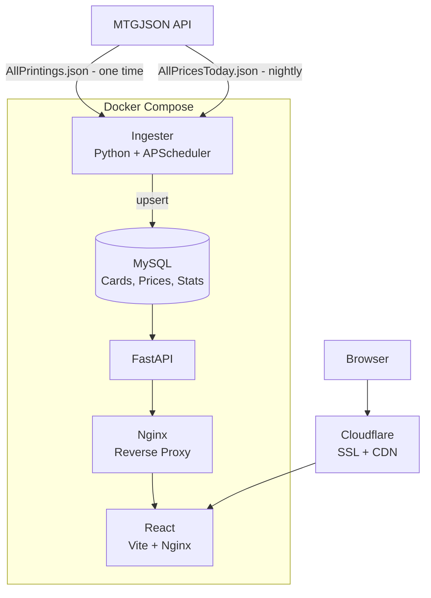

# MTG Archive

A full-stack data pipeline and dashboard for tracking Magic: The Gathering card prices. Pulls data from [MTGJSON](https://mtgjson.com), stores it in MySQL, and serves it through a FastAPI backend and React frontend.

Live at [mtga.noahlee.dev](https://mtga.noahlee.dev)

---

## What it does

- Seeds a database of 109,000+ cards and 855 sets from MTGJSON
- Runs a nightly pipeline to fetch the latest TCGPlayer prices
- Compiles daily market stats, most expensive card, average price by color, rarity, and mana cost
- Lets you search any card and view its price history

---

## Architecture



---

## Stack

| Layer          | Tech                                        |
| -------------- | ------------------------------------------- |
| Database       | MySQL 8.0                                   |
| Ingester       | Python 3.12, SQLAlchemy, ijson, APScheduler |
| API            | FastAPI, Uvicorn                            |
| Frontend       | React, Vite, Axios                          |
| Infrastructure | Docker Compose, AWS EC2, Cloudflare         |
| CI/CD          | GitHub Actions                              |

---

## Running locally

```bash
git clone https://github.com/YOUR_USERNAME/mtg-data-plane.git
cd mtg-data-plane
cp .env.example .env # fill in your own values in .env

docker compose -f docker-compose.yml -f docker-compose.dev.yml up --build
```

To seed the database on first run, set `SEED_ON_STARTUP=true` in `.env` before starting. Seeding takes several minutes, it streams 109k cards from a 300MB JSON file.

Once running:

- Frontend: [http://localhost:5173](http://localhost:5173)
- API docs: [http://localhost:8000/docs](http://localhost:8000/docs)

---

## API endpoints

| Method | Endpoint                    | Description                          |
| ------ | --------------------------- | ------------------------------------ |
| GET    | `/health`                   | Health check                         |
| GET    | `/cards/search?name={name}` | Search cards by name                 |
| GET    | `/cards/{uuid}`             | Get card with latest price           |
| GET    | `/cards/{uuid}/prices`      | Get price history for a card         |
| GET    | `/stats/latest`             | Get latest daily market stats        |
| GET    | `/stats/{date}`             | Get market stats for a specific date |
